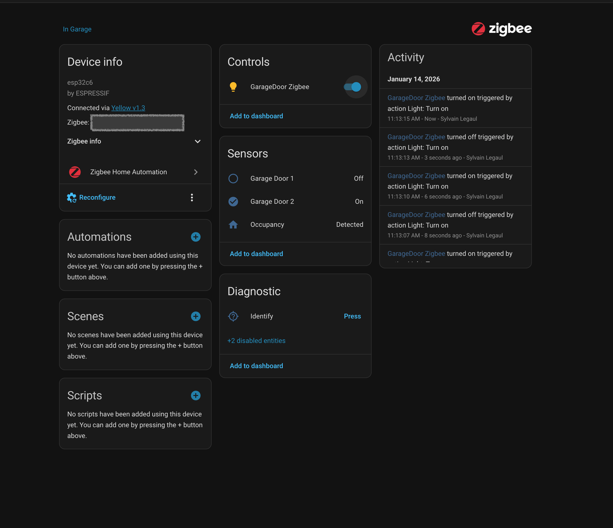

| Supported Targets | ESP32-C6 | 
| ----------------- | -------- |

Starting this project, I had lot of difficulties finding examples for more complex solution where you have multiple sensors
and are looking for a more complete solution where you can set values and support Identity feture.

This is my initial implementation, I'm no expert in either Zibee standard nor the Expressif ESP IDF but I hope this can help
others. Feel free to send me feeback, issues, PR to improve this project.
- How to have multiple endpoints and clusters with a single board. 
- How to implement the HA identity feature to blink the LED.
- How to create a binary sensor
- How to create a relay (switch)
- How to create a occupency (ultrsonic) sensor
- How to save attributes

I really would like to have a ZHA quirk for this project, but so far I wasn't successful to create any customs quirks. 
Help on this or any guideline would appreciated.

# Garage Door Example

This test code shows how to configure Zigbee end device and use it as HA with mutliple endpoints.

This was created from the ESP Zigbee SDK provides more examples and tools for productization:
* [ESP Zigbee SDK Docs](https://docs.espressif.com/projects/esp-zigbee-sdk)
* [ESP Zigbee SDK Repo](https://github.com/espressif/esp-zigbee-sdk)


## Hardware Required

* One development board with ESP32-C6 SoC acting as Zigbee end-device
* A USB cable for power supply and programming


## Home Assistant




## Configure the project

Before project configuration and build, make sure to set the correct chip target using `idf.py --preview set-target TARGET` command.

## Erase the NVRAM

Before flash it to the board, it is recommended to erase NVRAM if user doesn't want to keep the previous examples or other projects stored info using `idf.py -p PORT erase-flash`

## Build and Flash

Build the project, flash it to the board, and start the monitor tool to view the serial output by running `idf.py -p PORT flash monitor`.

(To exit the serial monitor, type ``Ctrl-]``.)

## Example Output

As you run the example, you will see the following log:

```
I (403) app_start: Starting scheduler on CPU0
I (408) main_task: Started on CPU0
I (408) main_task: Calling app_main()
I (428) phy: phy_version: 230,2, 9aae6ea, Jan 15 2024, 11:17:12
I (428) phy: libbtbb version: 944f18e, Jan 15 2024, 11:17:25
I (438) main_task: Returned from app_main()
I (548) ESP_ZB_ON_OFF_LIGHT: ZDO signal: ZDO Config Ready (0x17), status: ESP_FAIL
I (548) ESP_ZB_ON_OFF_LIGHT: Initialize Zigbee stack
W (548) rmt: channel resolution loss, real=10666666
I (558) gpio: GPIO[8]| InputEn: 0| OutputEn: 1| OpenDrain: 0| Pullup: 1| Pulldown: 0| Intr:0 
I (548) ESP_ZB_ON_OFF_LIGHT: Deferred driver initialization successful
I (568) ESP_ZB_ON_OFF_LIGHT: Device started up in  factory-reset mode
I (578) ESP_ZB_ON_OFF_LIGHT: Start network steering
I (3558) ESP_ZB_ON_OFF_LIGHT: Joined network successfully (Extended PAN ID: 74:4d:bd:ff:fe:63:f7:30, PAN ID: 0x13af, Channel:13, Short Address: 0x7c16)
I (10238) ESP_ZB_ON_OFF_LIGHT: Received message: endpoint(10), cluster(0x6), attribute(0x0), data size(1)
I (10238) ESP_ZB_ON_OFF_LIGHT: Light sets to On
I (10798) ESP_ZB_ON_OFF_LIGHT: Received message: endpoint(10), cluster(0x6), attribute(0x0), data size(1)
I (10798) ESP_ZB_ON_OFF_LIGHT: Light sets to Off
I (11228) ESP_ZB_ON_OFF_LIGHT: Received message: endpoint(10), cluster(0x6), attribute(0x0), data size(1)
I (11228) ESP_ZB_ON_OFF_LIGHT: Light sets to On
I (11618) ESP_ZB_ON_OFF_LIGHT: Received message: endpoint(10), cluster(0x6), attribute(0x0), data size(1)
I (11618) ESP_ZB_ON_OFF_LIGHT: Light sets to Off
```

## Garage Functions

### Main Functions

| Function | Description |
|----------|-------------|
| `app_main()` | Entry point that initializes NVS flash, configures Zigbee platform, and creates the main Zigbee task. |
| `esp_zb_task()` | Main Zigbee task that initializes the stack, creates all endpoints (binary sensors, ultrasonic sensor, relay), registers handlers, and starts the Zigbee main loop. |
| `esp_zb_app_signal_handler()` | Handles Zigbee application signals including network startup, steering, formation, device announcements, and permit join status. |

### Attribute & Action Handlers

| Function | Description |
|----------|-------------|
| `garage_action_handler()` | Main callback dispatcher that routes Zigbee actions (set attribute, report attribute, identify effects) to appropriate handlers. |
| `garage_set_attribute_handler()` | Processes incoming Zigbee attribute set messages for relay control and ultrasonic sensor configuration (threshold, delays). |

### Sensor Handlers

| Function | Description |
|----------|-------------|
| `zb_binary_sensor_handler()` | Handles binary sensor state changes (door open/closed), updates ZCL attributes, and reports changes to the coordinator. |
| `zb_ultrasonic_sensor_handler()` | Handles ultrasonic sensor occupancy changes, updates occupancy sensing attributes, and reports to the coordinator. |

### Identify & LED Functions

| Function | Description |
|----------|-------------|
| `identify_led_init()` | Initializes the WS2812 RGB LED on GPIO 8 for device identification. |
| `identify_led_blink_task()` | FreeRTOS task that blinks the LED during the identify period. |
| `zb_identify_notify_handler()` | Callback triggered when an identify command is received; starts/stops the LED blink task. |

### Driver Initialization

| Function | Description |
|----------|-------------|
| `deferred_driver_init()` | Initializes all hardware drivers (LED, relay, binary sensors, ultrasonic sensor) after Zigbee stack startup. |
| `bdb_start_top_level_commissioning_cb()` | Callback to restart commissioning process when network formation/steering fails. |

### Endpoints

| Endpoint | Type | Description |
|----------|------|-------------|
| 2 | Binary Sensor | Garage Door 1 - contact sensor on GPIO 21 |
| 3 | Binary Sensor | Garage Door 2 - contact sensor on GPIO 22 |
| 4 | Ultrasonic Sensor | Occupancy sensor using GPIO 2 (trigger) and GPIO 3 (echo) |
| 10 | Relay | On/Off light device for relay control on GPIO 23 |

## Troubleshooting

For any technical queries, please open an [issue](https://github.com/espressif/esp-idf/issues) on GitHub. We will get back to you soon.


# Todo

See if we can implement RSSI (3.13 RSSI Location): 

## Useful Commands

`source ~/esp/esp-idf/export.sh` 

`idf.py set-target esp32c6`

`idf.py fullclean`

`idf.py build`


`idf.py monitor` exit with `ctrl`+`]`

Using USB or on Linux 
`ls /dev/tty*`
`idf.py -p /dev/tty.usbmodem1401 flash` 
`idf.py -p /dev/tty.usbmodem1401 erase-flash`

Using UART or on MacOS  

`ls /dev/cu.*`
`idf.py -p /dev/cu.usbmodem1401 flash`
`idf.py -p /dev/cu.usbmodem1401 erase-flash`
`idf.py -p /dev/cu.usbmodem1401 monitor`

