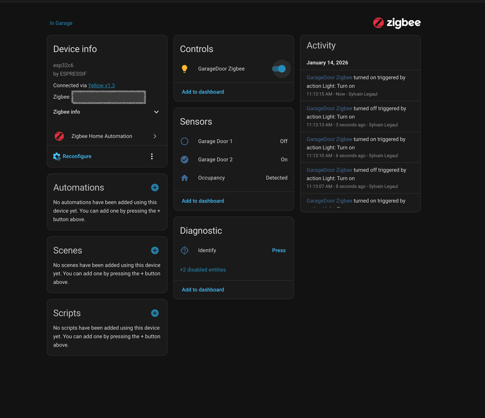

| Supported Targets | ESP32-C6 |
| ----------------- | -------- |

# ESP32-C6 Zigbee Garage Controller

A Zigbee end-device firmware for the ESP32-C6 that integrates two garage door contact sensors, two HC-SR04 ultrasonic occupancy sensors, and a relay output into a single HA-profile-compliant multi-endpoint device.

This project was built to address the lack of real-world examples demonstrating multiple Zigbee endpoints on a single board. It serves as a reference implementation for the following patterns:

- Multi-endpoint device with mixed sensor and actuator types
- ZCL-compliant Binary Input cluster (contact sensors)
- ZCL-compliant Occupancy Sensing cluster (ultrasonic sensors)
- Relay with configurable pulse duration via the standard `OnTime` attribute
- HA Identify feature driving a WS2812 RGB LED
- Persistent attribute storage using NVS
- ZHA custom quirk for Home Assistant integration

Contributions, issues, and pull requests are welcome.

> **References**
> - [ESP Zigbee SDK Documentation](https://docs.espressif.com/projects/esp-zigbee-sdk)
> - [ESP Zigbee SDK Repository](https://github.com/espressif/esp-zigbee-sdk)

---

## Table of Contents

- [Hardware](#hardware)
- [Zigbee Device Description](#zigbee-device-description)
- [Home Assistant Integration](#home-assistant-integration)
- [Getting Started](#getting-started)
- [Project Structure](#project-structure)
- [API Reference](#api-reference)
- [Useful Commands](#useful-commands)
- [Troubleshooting](#troubleshooting)

---

## Hardware

### Requirements

- ESP32-C6 development board (e.g., ESP32-C6-DevKitC-1)
- USB cable for power and programming
- HC-SR04 ultrasonic sensors (×2)
- Magnetic reed switches or other contact sensors (×2)
- Relay module (×1)

### GPIO Pin Assignment

| GPIO | Function | Description |
|------|----------|-------------|
| 8 | WS2812 LED | Onboard RGB LED — used for Identify indication |
| 18 | Ultrasonic Trigger (shared) | Shared trigger pin for both ultrasonic sensors |
| 19 | Ultrasonic Echo — Sensor 1 | Echo pin for occupancy sensor on endpoint 4 |
| 20 | Ultrasonic Echo — Sensor 2 | Echo pin for occupancy sensor on endpoint 5 |
| 21 | Binary Sensor 1 | Contact sensor input for garage door A (endpoint 2) |
| 22 | Binary Sensor 2 | Contact sensor input for garage door B (endpoint 3) |
| 23 | Relay Output | Relay control output (endpoint 10) |

> Binary sensor inputs use the internal pull-up resistor. Sensor state is determined by comparing the GPIO level to the configured `normal_level` value.

---

## Zigbee Device Description

The device registers as a **Zigbee End Device** (ZED) using the HA profile (`0x0104`).

### Endpoints

| Endpoint | HA Device ID | Type | Description |
|----------|-------------|------|-------------|
| 2 | `0x000C` Simple Sensor | Binary Input | Garage Door A — contact sensor on GPIO 21 |
| 3 | `0x000C` Simple Sensor | Binary Input | Garage Door B — contact sensor on GPIO 22 |
| 4 | `0x0107` Occupancy Sensor | Ultrasonic | Occupancy sensor — trigger GPIO 18, echo GPIO 19 |
| 5 | `0x0107` Occupancy Sensor | Ultrasonic | Occupancy sensor — trigger GPIO 18, echo GPIO 20 |
| 10 | `0x0002` On/Off Output | Relay | Momentary relay output — GPIO 23 |

### ZCL Clusters

#### Binary Sensor Endpoints (2 & 3)

| Cluster | Role | Key Attributes |
|---------|------|----------------|
| Basic (0x0000) | Server | ZCLVersion, PowerSource (0x03 DC), ManufacturerName, ModelIdentifier |
| Identify (0x0003) | Server | IdentifyTime |
| Binary Input (0x000F) | Server | PresentValue (RP), OutOfService, StatusFlags (RP) |

#### Occupancy Sensor Endpoints (4 & 5)

| Cluster | Role | Key Attributes |
|---------|------|----------------|
| Basic (0x0000) | Server | ZCLVersion, PowerSource (0x03 DC), ManufacturerName, ModelIdentifier |
| Identify (0x0003) | Server | IdentifyTime |
| Occupancy Sensing (0x0406) | Server | Occupancy (RP), OccupancySensorType (Ultrasonic=1), OccupancySensorTypeBitmap (0x02), UltrasonicO2UDelay (RW), UltrasonicU2ODelay (RW), UltrasonicU2OThreshold (RW) |

#### Relay Endpoint (10)

| Cluster | Role | Key Attributes |
|---------|------|----------------|
| Basic (0x0000) | Server | ZCLVersion, PowerSource (0x03 DC), ManufacturerName, ModelIdentifier |
| Identify (0x0003) | Server | IdentifyTime |
| On/Off (0x0006) | Server | OnOff (RP), OnTime (0x4001, RW — pulse duration in 100ms units) |

### Relay Behavior

The relay operates as a **momentary pulse output** rather than a latching on/off switch. When an `On` command is received:

1. The relay GPIO is driven LOW (relay energized) for the configured pulse duration.
2. After the pulse, the relay GPIO returns HIGH (relay off) and the `OnOff` attribute is automatically reported as `false`.

The pulse duration is controlled by the `OnTime` attribute (`0x4001`) on the On/Off cluster:
- Unit: **100 ms per increment** (e.g., `5` = 500 ms)
- Range: `0` (disabled — relay will not activate) to `655` (65.5 seconds)
- Default: `5` (500 ms)
- Persisted to NVS across reboots

### Occupancy Sensor Behavior

Each ultrasonic sensor continuously measures distance and compares it to a configurable threshold. The following attributes are writable from Home Assistant and persist to NVS:

| Attribute | ZCL ID | Description |
|-----------|--------|-------------|
| `UltrasonicUnoccupiedToOccupiedThreshold` | `0x0022` | Detection distance in cm (1–254). Default: 100 cm |
| `UltrasonicOccupiedToUnoccupiedDelay` | `0x0020` | Seconds to wait before reporting unoccupied. Default: 0 |
| `UltrasonicUnoccupiedToOccupiedDelay` | `0x0021` | Seconds to wait before reporting occupied. Default: 0 |

### Identify

All endpoints support the ZCL Identify cluster. When an Identify command is received on any endpoint, the onboard WS2812 RGB LED (GPIO 8) blinks white at 500 ms intervals for the requested duration.

---

## Home Assistant Integration



### ZHA Quirk

A custom ZHA quirk is provided in the [`homeassistant/`](./homeassistant/) directory to enable full attribute access from the ZHA integration. See [`homeassistant/README.md`](./homeassistant/README.md) for installation instructions and attribute reference.

Two quirk versions are available:
- **`espressif_garage.py`** — Basic quirk with custom attribute definitions
- **`espressif_garage_v2.py`** — Enhanced version with event buses for improved HA integration

### Setting Attributes via ZHA

Attributes can be written directly from **Settings → Devices & Services → ZHA → Manage Zigbee Device**, or via the `zha.set_zigbee_cluster_attribute` service.

**Example — Set relay pulse duration to 1 second:**
```yaml
service: zha.set_zigbee_cluster_attribute
data:
  ieee: "YOUR_DEVICE_IEEE_ADDRESS"
  endpoint_id: 10
  cluster_id: 6        # 0x0006 On/Off
  cluster_type: in
  attribute: 16385     # 0x4001 OnTime
  value: 10            # 10 × 100ms = 1 second
```

**Example — Set occupancy detection threshold to 80 cm:**
```yaml
service: zha.set_zigbee_cluster_attribute
data:
  ieee: "YOUR_DEVICE_IEEE_ADDRESS"
  endpoint_id: 4
  cluster_id: 1030     # 0x0406 Occupancy Sensing
  cluster_type: in
  attribute: 34        # 0x0022 UltrasonicUnoccupiedToOccupiedThreshold
  value: 80
```

---

## Getting Started

### Prerequisites

- ESP-IDF v5.3 or later ([Installation Guide](https://docs.espressif.com/projects/esp-idf/en/latest/esp32c6/get-started/))
- ESP32-C6 target toolchain

### 1. Set Up the Environment

```bash
source ~/esp/esp-idf/export.sh
```

### 2. Set the Target

```bash
idf.py set-target esp32c6
```

### 3. (Optional) Erase Flash

Recommended when flashing for the first time or after changing NVS schema:

```bash
idf.py -p PORT erase-flash
```

### 4. Build, Flash, and Monitor

```bash
idf.py -p PORT flash monitor
```

Press `Ctrl-]` to exit the serial monitor.

### Expected Serial Output

On first boot (factory-new state), the device will initialize the Zigbee stack and begin network steering:

```
I (428) ESP_ZB_GARAGE: Initialize Zigbee stack
I (548) GARAGE_DRIVER: Early relay init: GPIO 23 set HIGH (relay OFF)
I (558) ESP_ZB_GARAGE: Deferred driver initialization successful
I (568) ESP_ZB_GARAGE: Device started up in factory-reset mode
I (578) ESP_ZB_GARAGE: Start network steering
I (3558) ESP_ZB_GARAGE: Joined network successfully (Extended PAN ID: 74:4d:bd:ff:fe:63:f7:30, PAN ID: 0x13af, Channel:13, Short Address: 0x7c16)
I (3600) ESP_ZB_GARAGE: Reporting initial sensor states after joining
```

On subsequent reboots (already paired), the device rejoins automatically and reports initial states once the network closes:

```
I (568) ESP_ZB_GARAGE: Device rebooted
I (4200) ESP_ZB_GARAGE: Reporting initial sensor states after reboot
I (4300) ESP_ZB_SENSOR: Sensor endpoint 2, pin 21 initial state: IDLE (GPIO level: 1)
I (4500) ESP_ZB_SENSOR: Sensor endpoint 3, pin 22 initial state: DETECTED (GPIO level: 0)
```

---

## Project Structure

```
garage-esp-idf/
├── main/
│   ├── garage.c              # Application entry point, Zigbee signal handler, endpoint registration
│   └── garage.h              # Endpoint IDs, Zigbee configuration macros
├── components/
│   ├── include/
│   │   ├── binary_sensor.h   # Binary sensor driver API and endpoint config
│   │   ├── ultrasonic_sensor.h # Ultrasonic sensor driver API and endpoint config
│   │   ├── relay_driver.h    # Relay driver API and endpoint config
│   │   ├── identify_led.h    # Identify LED API
│   │   └── zcl_utility.h     # ZCL helper functions
│   └── src/
│       ├── binary_sensor.c   # GPIO ISR, debounce, ZCL attribute reporting
│       ├── ultrasonic_sensor.c # HC-SR04 driver, occupancy logic, ZCL cluster creation
│       ├── relay_driver.c    # Relay pulse task, NVS persistence, ZCL endpoint creation
│       ├── identify_led.c    # WS2812 LED blink task
│       └── zcl_utility.c     # Basic cluster manufacturer info helper
├── homeassistant/
│   ├── espressif_garage.py   # ZHA custom quirk (basic)
│   ├── espressif_garage_v2.py # ZHA custom quirk (enhanced)
│   └── README.md             # ZHA quirk installation guide
└── documentation/
    ├── ha-device.png
    └── ha-attribute.png
```

---

## API Reference

### Main Application (`main/garage.c`)

| Function | Description |
|----------|-------------|
| `app_main()` | Entry point. Performs early relay GPIO initialization, configures the Zigbee platform, initializes NVS, and creates the Zigbee task. |
| `esp_zb_task()` | Main Zigbee task. Builds the endpoint list, registers action handlers and identify callbacks, then starts the Zigbee stack main loop. |
| `esp_zb_app_signal_handler()` | Processes Zigbee BDB/ZDO signals: stack init, network steering, formation, device announcement, and permit-join status. |
| `garage_action_handler()` | Top-level ZCL action callback dispatcher (set attribute, report attribute, identify effect). |
| `garage_set_attribute_handler()` | Routes incoming ZCL write-attribute messages to the relay or ultrasonic sensor driver. |

### Binary Sensor (`components/src/binary_sensor.c`)

| Function | Description |
|----------|-------------|
| `garage_binary_sensor_ep_create()` | Creates the ZCL cluster list for a Binary Input endpoint (Basic + Identify + Binary Input). |
| `binary_sensor_init()` | Configures GPIO interrupts and starts the debounce task for all contact sensors. |
| `binary_sensor_zb_handler()` | Updates the `PresentValue` attribute and sends an unsolicited ZCL report on state change. |
| `binary_sensor_report_initial_states()` | Reads current GPIO levels and reports all sensor states to the coordinator on startup. |

### Ultrasonic Sensor (`components/src/ultrasonic_sensor.c`)

| Function | Description |
|----------|-------------|
| `garage_ultrasonic_sensor_ep_create()` | Creates the ZCL cluster list for an Occupancy Sensing endpoint (Basic + Identify + Occupancy Sensing). Loads persisted settings from NVS. |
| `ultrasonic_sensor_init()` | Starts the polling task that periodically measures distance and evaluates occupancy. |
| `ultrasonic_sensor_zb_handler()` | Updates the `Occupancy` attribute and sends an unsolicited ZCL report on state change. |
| `ultrasonic_sensor_report_initial_states()` | Reports current occupancy state for all sensors on startup. |
| `ultrasonic_sensor_set_threshold()` | Sets the detection distance threshold (cm) and persists it to NVS. |
| `ultrasonic_sensor_set_o2u_delay()` | Sets the occupied-to-unoccupied transition delay (seconds) and persists it to NVS. |
| `ultrasonic_sensor_set_u2o_delay()` | Sets the unoccupied-to-occupied transition delay (seconds) and persists it to NVS. |

### Relay Driver (`components/src/relay_driver.c`)

| Function | Description |
|----------|-------------|
| `relay_driver_early_init()` | Sets the relay GPIO HIGH as early as possible in `app_main` to prevent false activation during boot. |
| `garage_on_off_relay_ep_create()` | Creates the ZCL cluster list for the On/Off Output endpoint (Basic + Identify + On/Off with OnTime attribute). |
| `relay_driver_init()` | Configures relay GPIO and loads persisted pulse duration from NVS. |
| `relay_driver_set_power()` | Starts or cancels a relay pulse task. On activation, pulses the relay for the configured duration then auto-reports OFF. |
| `relay_driver_set_pulse_duration_from_ontime()` | Converts a ZCL `OnTime` value (100 ms units) to milliseconds and updates the pulse duration. |
| `relay_driver_load_settings()` | Loads saved pulse durations from NVS. |

### Identify LED (`components/src/identify_led.c`)

| Function | Description |
|----------|-------------|
| `identify_led_init()` | Initializes the WS2812 RGB LED on GPIO 8. |
| `identify_led_notify_handler()` | Identify cluster callback. Starts or stops the LED blink task (500 ms period, white). |

---

## Useful Commands

```bash
# Set up ESP-IDF environment
source ~/esp/esp-idf/export.sh

# Set target chip
idf.py set-target esp32c6

# Clean build artifacts
idf.py fullclean

# Build
idf.py build

# Monitor (exit with Ctrl+])
idf.py monitor
```

### Flash & Monitor by Port

**Linux (USB):**
```bash
ls /dev/tty*
idf.py -p /dev/ttyUSB0 flash monitor
idf.py -p /dev/ttyUSB0 erase-flash
```

**macOS (USB Serial):**
```bash
ls /dev/cu.*
idf.py -p /dev/cu.usbmodem1401 flash monitor
idf.py -p /dev/cu.usbmodem1401 erase-flash

# Alternative UART adapter
idf.py -p /dev/cu.usbserial-0001 flash monitor
idf.py -p /dev/cu.usbserial-0001 erase-flash
```

---

## Troubleshooting

| Symptom | Likely Cause | Solution |
|---------|-------------|----------|
| Device does not join network | Already paired to a different coordinator | Erase flash and re-pair |
| Relay activates unexpectedly on boot | GPIO floated before initialization | `relay_driver_early_init()` is called first in `app_main`; verify GPIO wiring |
| Sensors not reporting to HA | No coordinator bindings | Trigger an Identify command from ZHA to verify the endpoint is reachable |
| ZHA shows unknown device / missing attributes | Quirk not installed | Follow the [ZHA quirk installation guide](./homeassistant/README.md) |
| Ultrasonic sensor shows permanent `occupied` | Sensor wiring or threshold too large | Check HC-SR04 wiring; reduce detection threshold via `0x0022` attribute |
| `OnTime` write has no effect | Value out of range or wrong units | Units are 100 ms per increment; valid range is `0`–`655` |

For bug reports and feature requests, please open an issue on the project repository.

